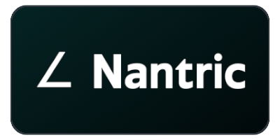

<!-- https://github.com/progfay/shields-with-icon/blob/master/README.md?plain=1 -->

  <a href="https://wiki.thijmenheuvelink.nl">
    <strong>Open my Wiki</strong>
  </a>
  &nbsp;&nbsp;&nbsp;|&nbsp;&nbsp;&nbsp;
  <a href="https://nantric.com">
    <strong>Visit Nantric</strong>
  </a>
  &nbsp;&nbsp;&nbsp;|&nbsp;&nbsp;&nbsp;
  <a href="https://github.com/ThijmenGThN?tab=repositories">
    <strong>View my projects</strong>
  </a>

 

  
  

  
  
  

