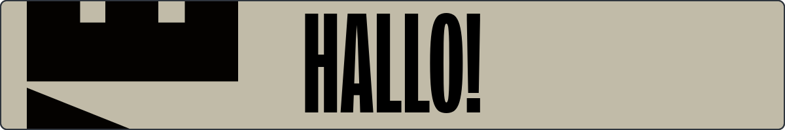

 

  
  
  
  
  
  
  
  
 
  <a href="https://wiki.nantric.com">
    <strong>Open my wiki</strong>
  </a>
  &nbsp;&nbsp;&nbsp;|&nbsp;&nbsp;&nbsp;
  <a href="https://nantric.com">
    <strong>Visit ∠ Nantric</strong>
  </a>
  &nbsp;&nbsp;&nbsp;|&nbsp;&nbsp;&nbsp;
  <a href="https://github.com/ThijmenGThN?tab=repositories">
    <strong>View my projects</strong>
  </a>

 

  
  
  

